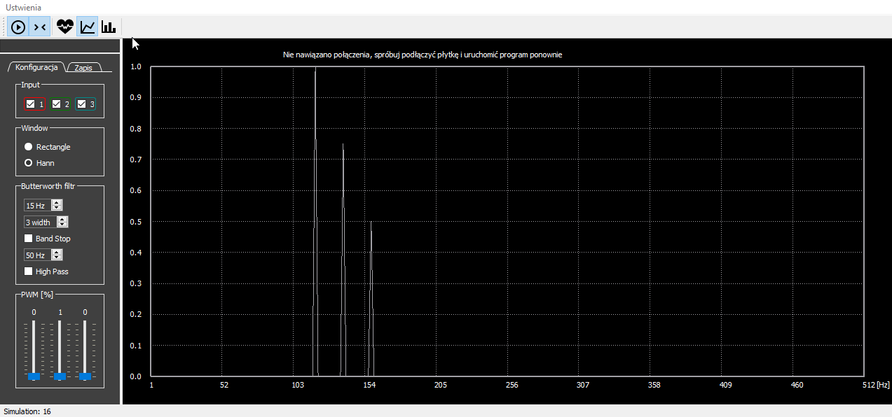
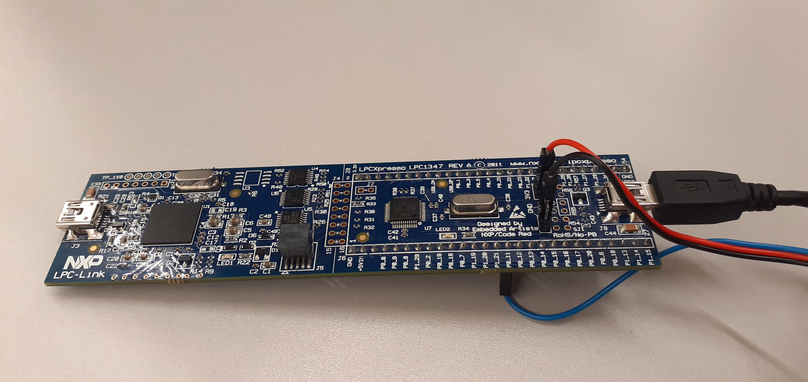
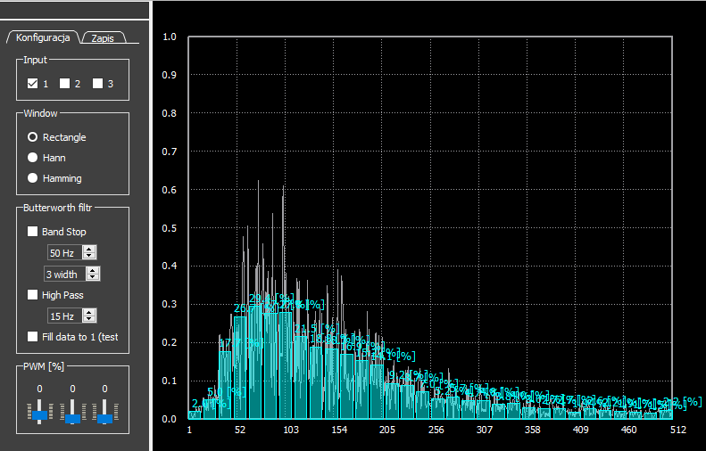
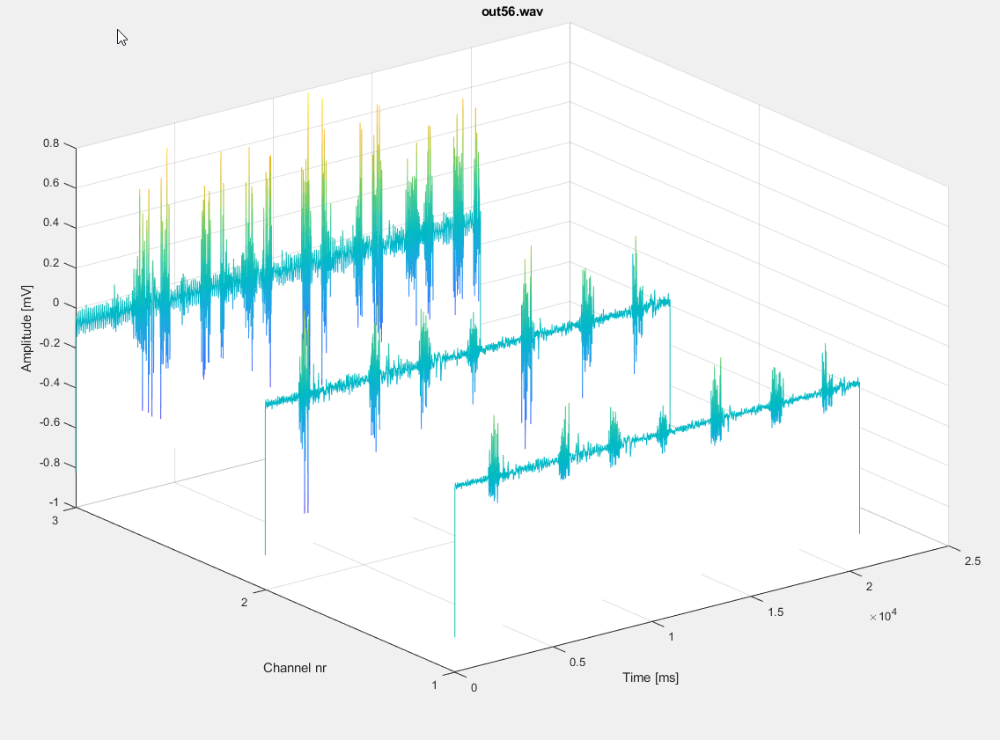

# FingerEMG  (deprecated)

Aplikacja generująca sygnał "3 mnichów" w dziedzine częstotliwości, rozwój zakończony w grudnu 2019 roku w trakcie długich oczekiwaniań na sprzęt   

## Generowanie sygnałów

# Po pewnym czasie ... 

##### Specyfikacja sprzętowa:
	 LPC1347 32-bit ARM Cortex-M3 mikrokontroler
	 DFRobot Gravity - analogowy czujnik EMG

## Elektrody podpinamy kolejno zacznąc od pinu P0_11 (obecnie 3 kanały)

## Widmo charakterystyczne EMG, zaciśnięta dłoń (0-512Hz)  

## Elektroda wykrywając pracę mięśni palca środkowego i serdecznego (Spiderman)

## Synały z trzech kanałów: niepodpięty kanał (ujemna amplituda niesymetryczna), kanał 2-gi i 3-ci podpięty jest do prawej i lewej dłoni zaciskanych naprzemiennie przez 20 sekund

