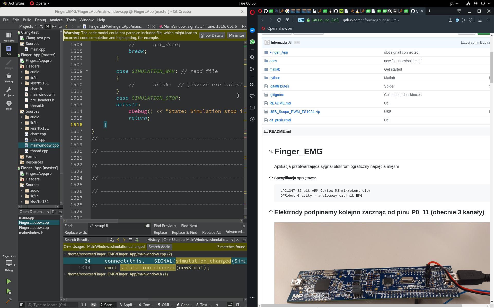
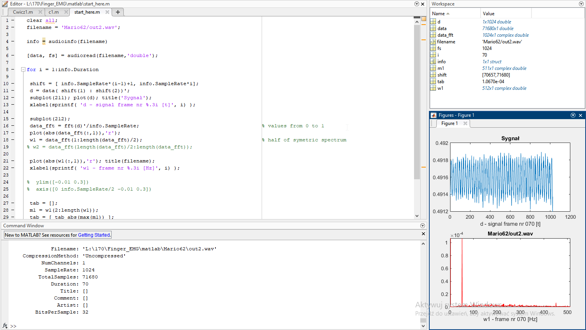
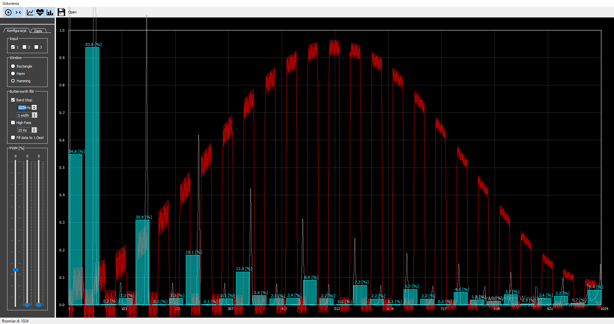
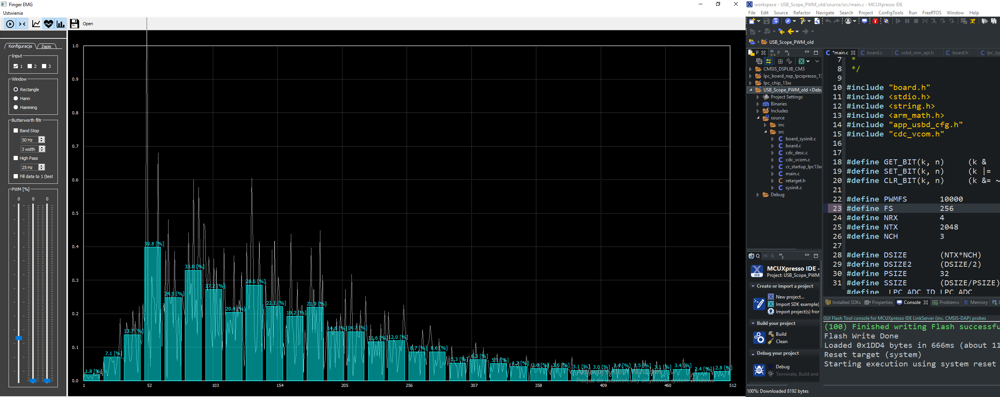
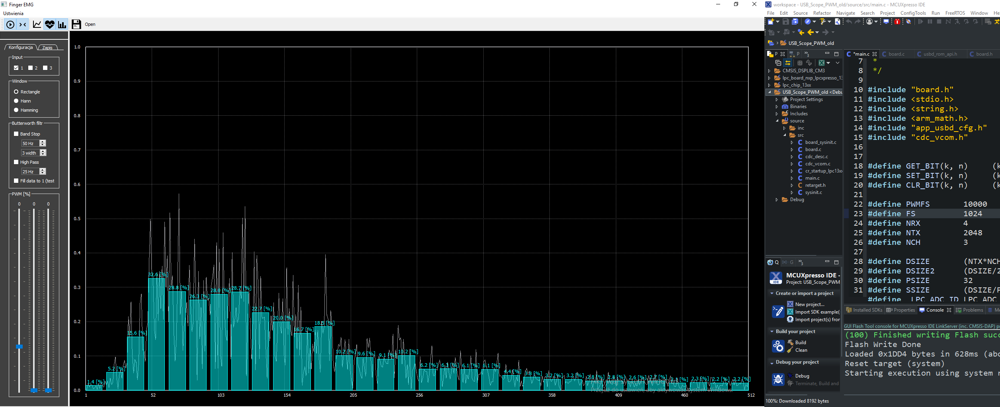

# Finger_EMG 
Aplikacja przetwarzająca sygnał elektromiograficzny napięcia mięśni   

##### Specyfikacja sprzętowa:
	 LPC1347 32-bit ARM Cortex-M3 mikrokontroler
	 DFRobot Gravity - analogowy czujnik EMG

## Elektrody podpinamy kolejno zacznąc od pinu P0_11 (obecnie 3 kanały)

## Elektroda wykrywając pracę mięśni palca środkowego i serdecznego  

## Widmo charakterystyczne EMG, zaciśnięta dłoń (0-512Hz)  

## Linux VBox  

### Matlab wave fft

### Start_here.m script 

### Hann window (red)

#### FS 256

#### FS 1024

# Instrukcja obsługi aplikacji 
### Nawigacja 

>Zalecaną metodą obsługi jest używanie skrótów klawiaturowych
	
> <kbhit>Ctrl</kbhit> + <kbhit>Tab</kbhit> zmiana karty 
		
> Wszystkie ustawienia przłączalne (toggle) można ustawiać  <kbhit>Ctrl</kbhit> + <kbhit>numer</kbhit> 
		
> Aby rozpocząć nagrywanie, upewniamy się, że aktualna zakładka to **zapis** naciskamy <kbhit>Enter</kbhit> pasek postępu zacznie się wypełniać
		
### Zapis 
> Open tab "Save" and just press <kbhit> Enter </kbhit>, progress bar should fill in.

# ButterWorth
## Bez filtracji

## Po wycięciu 50Hz

## Band Stop

## High Pass

### Asymptota szumu (zielony)
Widmo jest symetryczne, tu widzimy lewą połowę widma, oś symetrii jest na krawędzi obrazu

