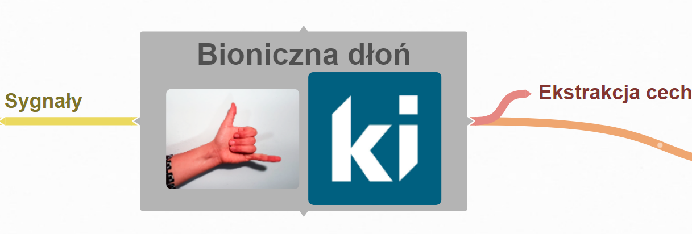

# EMG
Celem projektu jest stworzenie prototypu dłoni reagującego w czasie rzeczywistym.

## [Concept](https://stijournal.pl/resources/html/article/details?id=204954&language=en)  [pl](https://stijournal.pl/resources/html/article/details?id=204954&language=pl) 

[Podgląd mapy projektu](https://coggle.it/diagram/X3_3tBiU9E_wpker/t/bioniczna-d%C5%82o%C5%84-image-ki/6e02177ca5137de29b0a257721d5d5c0df390b9d885b2d90c6b684851fdd79f3)

### FAQ
Co to jest [sEMG](https://pl.wikipedia.org/wiki/Elektromiografia)?

> Jest to powierzchniowe (eng. **s**urface) badanie bio**e**lektrycznej aktywności **m**ięśni.  

### References
[Signal Classification Using Dictionary Learning](https://www.mdpi.com/1424-8220/19/10/2370)

[Efektywne metody selekcji cech (SVM)](https://www.ippt.pan.pl/_download/doktoraty/2013chmielnicki_w_doktorat.pdf)

[ HILBERT HUANG RELATED MATHEMATICAL PROBLEMS](docs/HHT.pdf)

#### Zadania (ToDo):
- Zbieranie sygnałów [instrukcja](https://github.com/informacja/EMG/tree/master/matlab/instrukcja#readme)
- [Sieci neuronowe](http://playground.tensorflow.org/#activation=tanh&batchSize=10&dataset=circle&regDataset=reg-plane&learningRate=0.03&regularizationRate=0&noise=0&networkShape=4,6&seed=0.26866&showTestData=false&discretize=false&percTrainData=50&x=true&y=true&xTimesY=false&xSquared=true&ySquared=false&cosX=false&sinX=false&cosY=false&sinY=false&collectStats=false&problem=classification&initZero=false&hideText=false) (wizualizacja)

