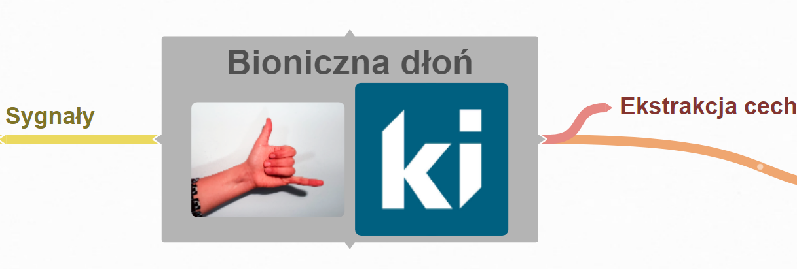

# EMG
Application collecting sEMG data written in C++ &amp; Signal processing in Matlab

## [Concept](https://stijournal.pl/resources/html/article/details?id=204954&language=en)  [pl](https://stijournal.pl/resources/html/article/details?id=204954&language=pl) 

[Podgląd Mapy](https://coggle.it/diagram/X3_3tBiU9E_wpker/t/bioniczna-d%C5%82o%C5%84-image-ki/6e02177ca5137de29b0a257721d5d5c0df390b9d885b2d90c6b684851fdd79f3)
### References: 
[Signal Classification Using Dictionary Learning](https://www.mdpi.com/1424-8220/19/10/2370)

### FAQ
Co to [sEMG](https://pl.wikipedia.org/wiki/Elektromiografia)?
> Jest to badanie powierzchniowe (eng. **s**urface) sygnau aktywności **e**lektrycznej  **m**ięśni.  
    
