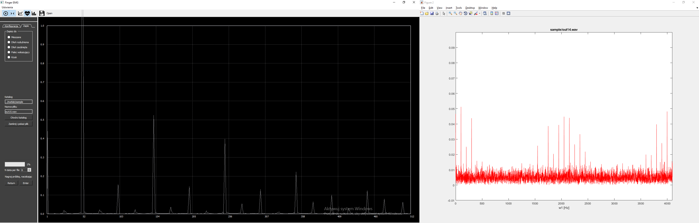
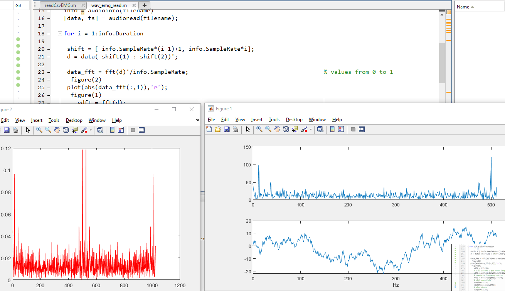

# Matlab wave fft

# ToDo
> Matlab read file

> 200 sample per cat

>Easy readable readme
## Info how to save sample
 Open tab "Save" and just press <kbhit> Enter </kbhit>, progress bar should fill in.
 
# ButterWorth
## Bez filtracji

## Po wycięciu 50Hz

## Band Stop

## High Pass

### Asymptota szumu 

