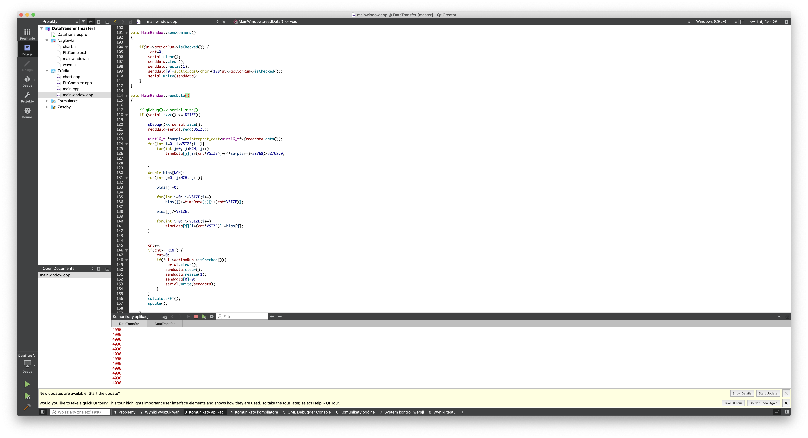
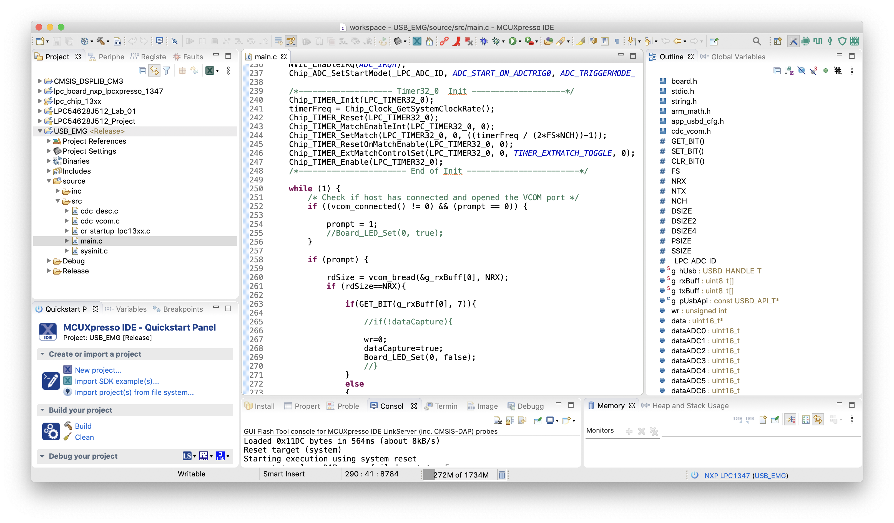

# waveApp

## Instrukcja

    Do obsługi prototypu przygotowane jest oprogramowanie
    1. [Akwizycji](DataTransfer_EMG_2_2.zip)
    3. [Pomiarowe](M3LPC1347USB_EMG.zip)
    

### Pomyślna konfiguracja IDE 
1. 
    
2. 