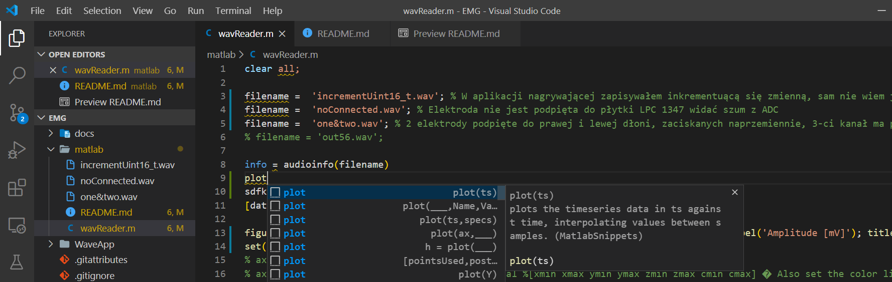
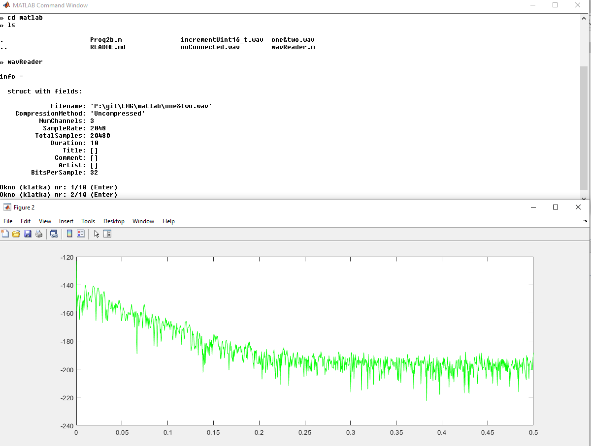
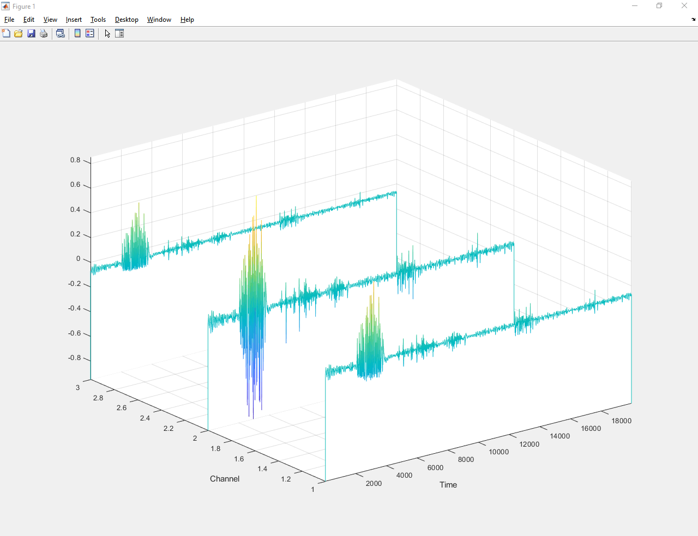

# Matlab WaveReader

> Wtyczka wsparcia dla języka [Matlab do edytora VS Code](https://marketplace.visualstudio.com/items?itemName=bat67.matlab-extension-pack#review-details)

>[alternative Matlab ide](https://marketplace.visualstudio.com/items?itemName=marmottet.ami) 

### Trzy kanały (pierwszy jest w środku)

