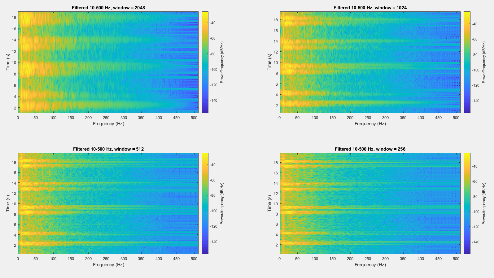
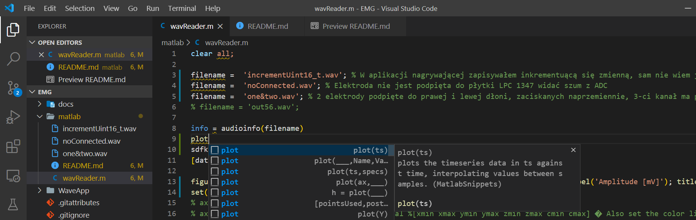

> Czy sygnału miograficznego można słuchać, tak jak dzwięku? Cisnienie akustyczne to różnica ciśnienia atmosferycznego. Wobec tego "mowa" mięśni to różnica od "masy" potencjału elektrycznego ciała?

 **Tak, powiem więcej, warto nawet przeskalować (resampling) badany sygnał do pasma słyszalnego przez ludzi** *~TZ*

>[Analiza one&two.wav
](https://htmlpreview.github.io/?https://raw.githubusercontent.com/informacja/EMG/master/matlab/Spectral%20Analysis/Prog2b.html)

## Matlab Editor VS Code 

> Wtyczka wsparcia *lint, snippets, run* dla języka [Matlab do edytora VS Code
](https://marketplace.visualstudio.com/items?itemName=bat67.matlab-extension-pack#review-details)
<!-- 
>[alternative Matlab ide
](https://marketplace.visualstudio.com/items?itemName=marmottet.ami)  
-->

### Instalacja biblioteki
Copy and paste this in your MATLAB console
```matlab
proj_path = pwd;
cd(fullfile(userpath));
urlwrite ('https://raw.githubusercontent.com/informacja/MTF/main/startup.m', 'startup.m');
 urlwrite ('https://raw.githubusercontent.com/informacja/MTF/main/figPSW.m', 'figPSW.m');
  urlwrite ('https://raw.githubusercontent.com/informacja/MTF/main/figPW.m', 'figPW.m');
startup;
cd(proj_path);
fprintf(1,'Now you can type here "figPW" or figPW("svg") to save last figure. If you want save all opened figures just run "figPSW".\nIf you add an extension as a first parmeter timestamp will be added to filename\n')
```

### Wywołanie biblioteki i zapis wszystkich figur
```matlab
% put this at the end of your code
if ~isfile('figPSW.m')
 urlwrite ('https://raw.githubusercontent.com/informacja/MTF/main/figPSW.m', 'figPSW.m');
end
figPSW;
```
 
### Zapis do pliku \*.png wszystkich rysunków
```matlab
h2 = findall(groot,'Type','figure');
h3 = findobj('Type','figure');

if ~isfile('figPW.m')
 urlwrite ('https://raw.githubusercontent.com/informacja/MTF/main/figPW.m', 'figPW.m');
end

for i = 1:length(h2)
    figure(h2(i))
    figPW;
end
```

### Zapis do pliku z numerem figury
```matlab
[a,fname,c] = fileparts( mfilename('fullpath'));                        % get current m-file name
print( strcat(fname, '_', num2str(get(gcf,'Number')), '.png'),'-dpng'); % save file CurrentMFile-lastFigureNumber.png

```

https://stijournal.pl/resources/html/article/details?id=204954#233202
