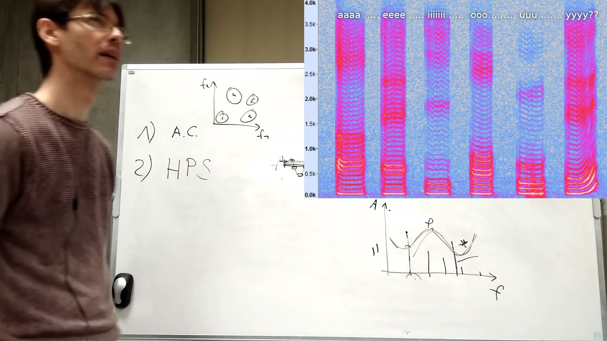

### Wstęp teoretyczny
>[Film rozpoznawaie płci mówcy z audio
](https://www.youtube.com/watch?v=4R5uvJW9fXs) 

### Matlab

> Pochodna 

> RMS

> Spectrum

https://www.mathworks.com/help/signal/transforms.html?category=transforms&s_tid=CRUX_gn_documentation_transforms
https://www.mathworks.com/help/signal/ref/spectrogram.html#bultmx7-ps
https://www.mathworks.com/help/signal/ref/spectrogram.html#d120e158846
https://www.mathworks.com/help/signal/ug/bias-and-variability-in-the-periodogram.html