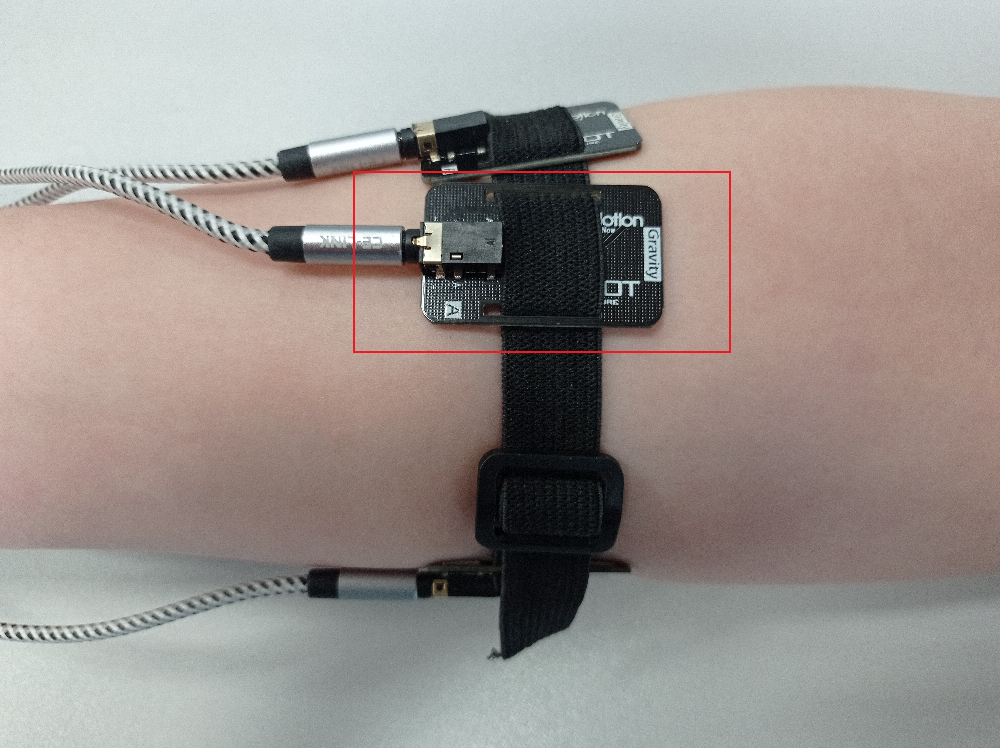
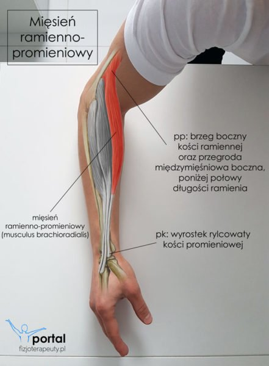
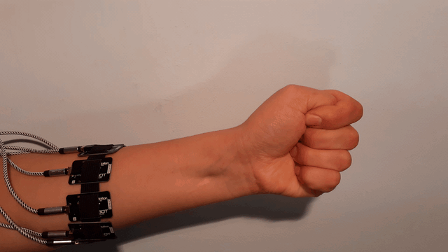
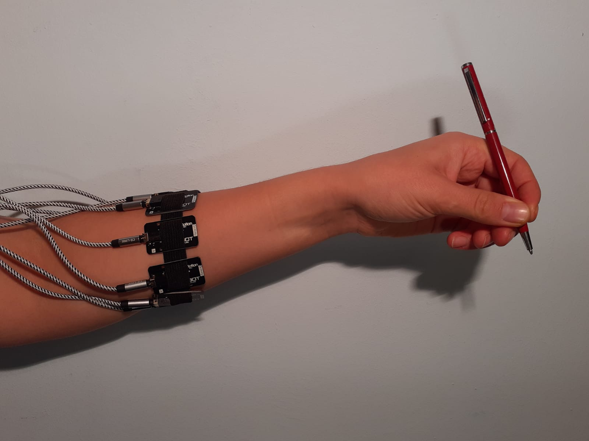
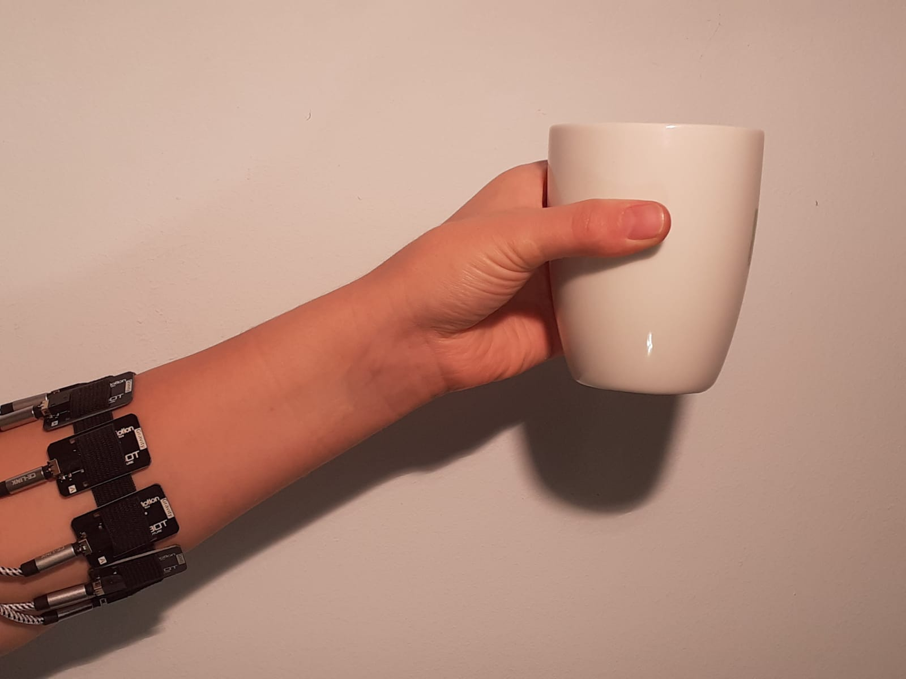

# Instrukcja

- [Instrukcja](#instrukcja)
    - [Przygotowanie przed zbieraniem sygnałów](#przygotowanie-przed-zbieraniem-sygnałów)
      - [Przygotowanie skóry](#przygotowanie-skóry)
      - [Ułożenie elektrod](#ułożenie-elektrod)
      - [Pozycja mięśnia](#pozycja-mięśnia)
  - [Gesty prawej dłoni](#gesty-prawej-dłoni)
  - [Przekazanie sygnałów](#przekazanie-sygnałów)

### Przygotowanie przed zbieraniem sygnałów
#### Przygotowanie skóry
> Skóra musi zostać odtłuszczona za pomocą płynu dezynfekującego oraz pozbawiona owłosienia

#### Ułożenie elektrod
> Elektroda nr 1 umieszczony na mięśniu ramienno-promieniowym, kolejność kanałów w stronę zewnętrzną, patrząc od strony pacjenta.

> Należy zwrócić uwagę na ułożenie elektrody względem sprzączki.
> 
> 
#### Pozycja mięśnia
> Jest obserwowalna przy rotacji dłoni
> 
> 

## Gesty prawej dłoni 
> 0. Rozluźniona (rererencyjny pomiar szumu) 

> 1. Moutza moc - Otwarta dłoń z szeroko rozpostartymi palcami 

> 2. Zaciśnięta pięść z kciukiem na zewnątrz pięści (elektrody to nie kajdanki :wink:) 
<!--  kciuk do srodka -->

> 3. OK - trzymać poziom (zeroKiled) 

> 4. Wskazywanie palcem (pistolet) <!--  -->

> 5. Kciuk w górę
<!--  -->

> 6. Call me
<!--  -->

> 7. Łapawica, tak zwana jaszczurka 

> 8. Otwieranie dłoni 

> 9. Zginanie palców po kolei
> <!--  -->

> 10.  Trzymanie ołówka 

LUB
11.   Trzymanie kubka 

## Przekazanie sygnałów
[Gdrive](https://drive.google.com/drive/folders/1npeQl9UDTk9C8ySy3Q2Y92O75FMjxhix?usp=sharing) (należy poprosić o dostęp z wyprzedzeniem :wink:)

> Ciekawostka
>
>

[Koncept PDF](https://stijournal.pl/resources/html/article/details?id=204954#233202)
