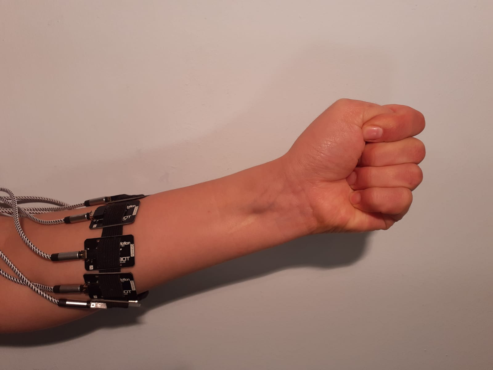
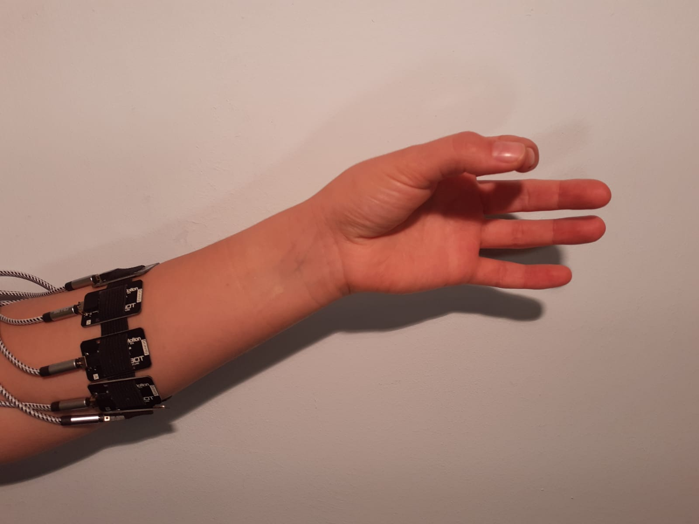
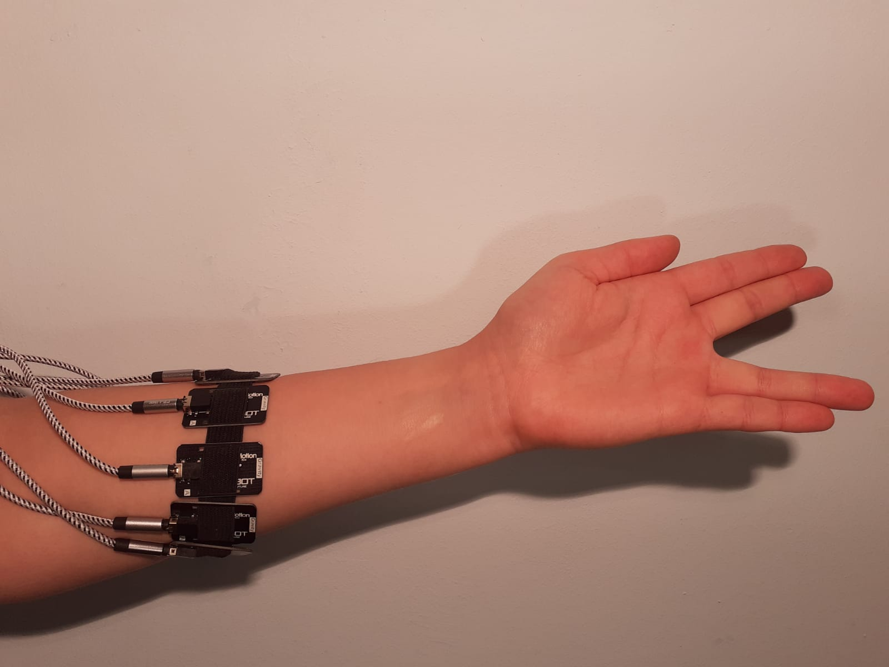
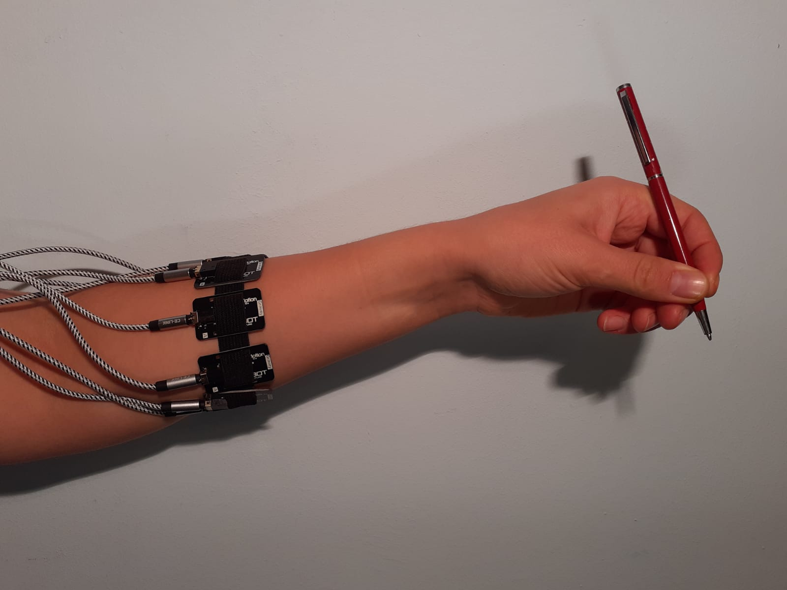

# Instrukcja
### Przygotowanie 
Kanał pierwszy umieszczony na mięśniu ramienno-promieniowym, kolejność kanałów w stronę zewnętrzną, patrząc od strony pacjęta.

## Gesty dłoni (9)
1. Rozluźniona (pomiar szumu)

2. Zacśnięta pięść (elektrody to nie kajdanki :wink:)

3. zaciskanie
4. rozluźnianie
5. Łapawica, tak zwana jaszczurka

6. 
7. Trzymanie długopisu 
8. Trzymanie kubka 
9. Gest spidermana 

## Przekazanie sygnałów
[Gdrive](https://drive.google.com/drive/folders/1npeQl9UDTk9C8ySy3Q2Y92O75FMjxhix?usp=sharing) (należy poprosić o dostęp, w wyprzedzeniem)

[Koncept PDF](https://stijournal.pl/resources/html/article/details?id=204954#233202)
