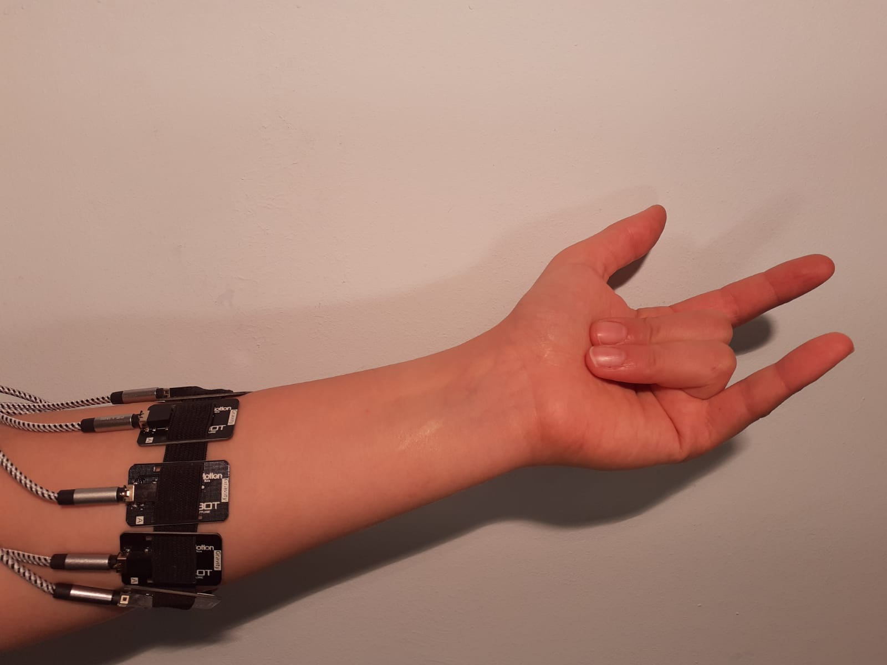

# Instrukcja
### Przygotowanie przed zbieraniem sygnałów
Miejsce między nadgarstkiem, a łokciem (długość elektrody to ok. 5 cm) musi zostać oczyszczone z: owłosienia, martwego naskórka, tłuszczu (należy przetrzeć skórę roztworem o minimalnym stężeniu alkoholu 70%)

> Kanał pierwszy umieszczony na mięśniu ramienno-promieniowym, kolejność kanałów w stronę zewnętrzną, patrząc od strony pacjenta.
>
> 

## Gesty prawej dłoni (10)
0. Rozluźniona (pomiar szumu)
[ Howdy Image Here ](docs/)
1. Moc 

2.  Zaciśnięta pięść (elektrody to nie kajdanki :wink:)

3. zaciskanie OK

4. rozluźnianie

5. Łapawica, tak zwana jaszczurka

6. Viktoria 

7. Up&Down
8. Trzymanie kubka 
9. Gest spidermana 

## Przekazanie sygnałów
[Gdrive](https://drive.google.com/drive/folders/1npeQl9UDTk9C8ySy3Q2Y92O75FMjxhix?usp=sharing) (należy poprosić o dostęp z wyprzedzeniem :wink:)

[Koncept PDF](https://stijournal.pl/resources/html/article/details?id=204954#233202)
> Ciekawostka
>
>
